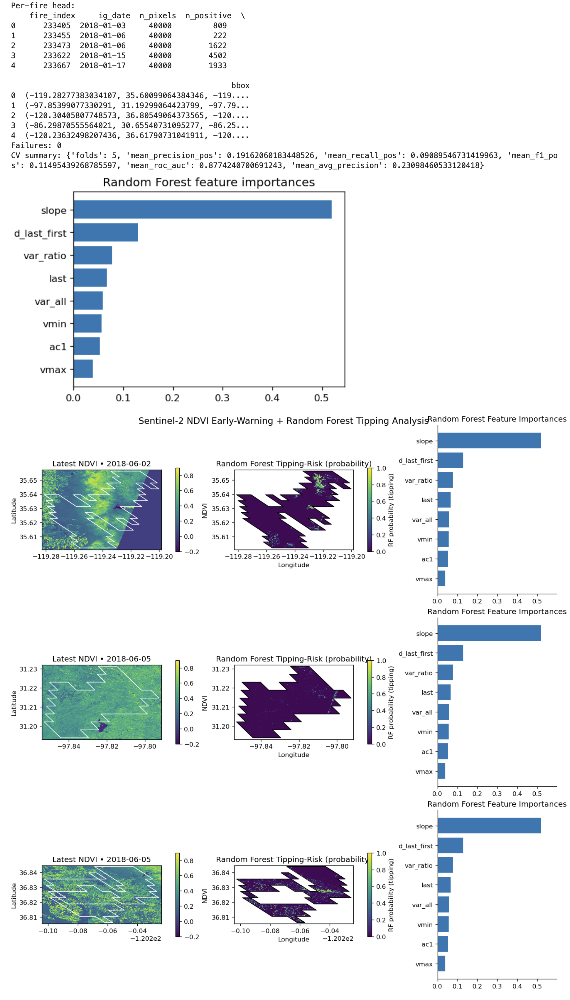

# Burning Boundaries: Random Forest Early Warnings for Post-Fire Collapse

## Introduction

Wildfires can push ecosystems across **tipping points**—for example, from forests to shrublands—when vegetation fails to recover after disturbance. This analytics entry describes a reproducible workflow that:

* Aligns **fire events** (from the FIRED database) with **satellite vegetation time series** (Sentinel‑2 NDVI);
* Extracts **early‑warning signals (EWS)** from those time series; and
* Trains a **Random Forest (RF)** classifier to flag pixels that show **persistent post‑fire vegetation collapse**.

The approach integrates three research strands: fire event mapping (FIRED), critical‑transition theory (EWS), and remote‑sensing machine learning.

## Data Sources

**Fire Events: FIRED (Fire Events Data)**

* Source: Andela et al. (2019, *Nature Ecology & Evolution*); Balch et al. (2020, CU Scholar dataset).
* Content: Event‑level and daily polygons delineating individual wildfires globally.
* Usage here: Event polygons for CONUS + Alaska, including ignition date (`ig_date`) and fire perimeter geometry.
* Format: GeoPackage or Shapefile; read into a GeoDataFrame (EPSG:4326).

**Vegetation Time Series: Sentinel‑2 Level‑2A NDVI**

* Coverage: Mid‑2015 to present.
* Resolution: 10 m (red and near‑infrared bands).
* Access: SpatioTemporal Asset Catalog (STAC) APIs (e.g., Earth‑Search by Element84).
* Representation in code: 3‑D array `(time, height, width)` containing NDVI values.

> Optional: Other indices (e.g., Enhanced Vegetation Index, Normalized Burn Ratio) and other sensors (e.g., Landsat, PlanetScope) can be incorporated similarly.

## Why This Matters

* **Ecological resilience**: Provides evidence on whether ecosystems exhibit critical transitions after fire.
* **Management & restoration**: Identifies high‑risk areas where recovery is unlikely without intervention.
* **Theory into practice**: Tests whether statistical early‑warning indicators (e.g., variance, autocorrelation, trend) can predict persistent vegetation collapse.

## Workflow (Step‑by‑Step)

1. **Select fires** from FIRED (e.g., `ig_year >= 2018`, `tot_ar_km2 > 10`).
2. **Build time windows** around ignition date: `pre_days` (e.g., 120) before ignition, `post_days` (e.g., 180) after ignition, split into rolling windows (`window_days`, `step_days`).
3. **Fetch NDVI stacks** from Sentinel‑2 via STAC for each window and the fire’s bounding box, with a cloud cover filter (`cloud_lt`).
4. **Compute pre vs post means** of NDVI for each pixel.
5. **Rasterize the fire polygon** to the NDVI grid to identify burned pixels.
6. **Label pixels**: collapse = 1 if NDVI drop exceeds a threshold (relative or absolute); non‑collapse = 0 otherwise.

   * Relative drop:
     $\text{rel\_drop} = \frac{\text{pre\_mean} - \text{post\_mean}}{|\text{pre\_mean}| + \varepsilon}$
     If `rel_drop > \theta` (e.g., \(\theta = 0.30\)) inside the fire scar, label = 1.
   * Absolute drop: If post – pre < threshold (e.g., –0.20), label = 1.
7. **Extract early‑warning features** from each pixel’s NDVI time series:

   * *Slope*: overall trend;
   * *Variance*: volatility over time;
   * *Variance ratio*: short vs long window variance;
   * *Autocorrelation (AC1)*: lag‑1 memory;
   * *Last, Δ(last–first), minimum, maximum*: trajectory summary.
8. **Train a Random Forest classifier** (Breiman 2001) with grouped cross‑validation by fire (GroupKFold) to avoid leakage across pixels from the same event.
9. **Evaluate performance** using ROC‑AUC, average precision (PR‑AUC), precision, recall, and F1 for the positive (collapse) class.
10. **Interpret outputs**: feature importances, per‑fire summaries, and optional spatial maps of predicted collapse.

## Mathematical Framing

We treat NDVI as a proxy for green biomass and canopy condition. Persistent collapse is operationalized as a significant NDVI drop post‑fire that does not rebound within the defined window.

* **Label rule**: collapse if relative or absolute NDVI decline exceeds a threshold.
* **EWS features** capture time‑series properties theorized to increase near critical transitions (Scheffer et al. 2009; Dakos et al. 2012).
* **Model**: Random Forest learns nonlinear mappings from feature space → probability of collapse.

## Model & Validation

* **Classifier**: Random Forest with \~500 trees, class‑weighted, `min_samples_leaf = 2`.
* **Grouping**: GroupKFold by fire to prevent over‑optimistic results.
* **Metrics**: ROC‑AUC, PR‑AUC, positive‑class precision, recall, and F1.
* **Outputs**: bar plot of feature importances; summary tables of per‑fire performance and data coverage.

## Example Use Case

**Research question**: Within large fires from 2018–2023, where did vegetation most likely transition to a persistent low‑NDVI state?
Steps:

1. Filter FIRED events based on size and date.
2. Build dataset with `rel_drop_threshold=0.30`, `cloud_lt=20` (relax to 60 if imagery is sparse).
3. Train Random Forest with grouped cross‑validation.
4. Inspect performance and feature importance; map collapse risk within each burn.
5. Export summaries to guide restoration prioritization.

## Limitations & Best Practices

* **Label uncertainty**: NDVI collapse does not guarantee irreversible ecological state change; field data are crucial for validation.
* **Window design**: At least 2–3 windows pre‑ and post‑fire are needed to avoid mistaking short‑term scorch for collapse.
* **Cloud/seasonal effects**: Clouds and seasonal phenology can bias NDVI features; seasonal adjustment is recommended.
* **Domain shift**: Models trained on one ecoregion or period may not generalize elsewhere; always use grouped CV and out‑of‑region testing.

## References

* Andela, N., Morton, D. C., Giglio, L., Chen, Y., van der Werf, G. R., Kasibhatla, P. S., DeFries, R. S., Collatz, G. J., Hantson, S., Kloster, S., Bachelet, D., Forrest, M., Lasslop, G., Li, F., Mangeon, S., Melton, J. R., Yue, C., & Randerson, J. T. (2019). The Global Fire Atlas of individual fire size, duration, speed and direction. *Nature Ecology & Evolution*, 3, 1494–1502. [https://doi.org/10.1038/s41559-019-0386-1](https://doi.org/10.1038/s41559-019-0386-1)
* Balch, J. K., et al. (2020). FIRED: a global fire event database for the analysis of fire regimes, patterns, and drivers. CU Scholar Dataset.
* Scheffer, M., Bascompte, J., Brock, W. A., Brovkin, V., Carpenter, S. R., Dakos, V., Held, H., van Nes, E. H., Rietkerk, M., & Sugihara, G. (2009). Early‑warning signals for critical transitions. *Nature*, 461, 53–59. [https://doi.org/10.1038/nature08227](https://doi.org/10.1038/nature08227)
* Dakos, V., Carpenter, S. R., Brock, W. A., Ellison, A. M., Guttal, V., Ives, A. R., Kéfi, S., Livina, V., Seekell, D. A., van Nes, E. H., & Scheffer, M. (2012). Methods for detecting early warnings of critical transitions in time series: A review. *PLOS ONE*, 7(7), e41010. [https://doi.org/10.1371/journal.pone.0041010](https://doi.org/10.1371/journal.pone.0041010)
* Kéfi, S., Guttal, V., Brock, W. A., Carpenter, S. R., Ellison, A. M., Livina, V. N., Seekell, D. A., van Nes, E. H., & Scheffer, M. (2014). Early warning signals of ecological transitions: methods for spatial patterns. *Philosophical Transactions of the Royal Society B*, 370(1659), 20130283. [https://doi.org/10.1098/rstb.2013.0283](https://doi.org/10.1098/rstb.2013.0283)
* Breiman, L. (2001). Random forests. *Machine Learning*, 45(1), 5–32. [https://doi.org/10.1023/A:1010933404324](https://doi.org/10.1023/A:1010933404324)
* Hesketh, M., et al. (2021). Detecting post‑fire vegetation recovery using remote sensing and machine learning. *Remote Sensing of Environment*, 257, 112210. [https://doi.org/10.1016/j.rse.2020.112210](https://doi.org/10.1016/j.rse.2020.112210)
* Liu, X., et al. (2020). Remote sensing‑based early warning of vegetation degradation. *Ecological Indicators*, 115, 106764. [https://doi.org/10.1016/j.ecolind.2020.106764](https://doi.org/10.1016/j.ecolind.2020.106764)
---

## Code
> **Note:** Requires rasterio, numpy, pandas, shapely, pystac-client, scikit-learn, and matplotlib.

```python

# ===================== DEPENDENCIES: fetch_ndvi_stack + _extract_ews_features =====================
# Requires: rasterio, numpy, pandas, pystac-client (pip install pystac-client)
# Notes:
#  - Works with Sentinel-2 L2A on Element84 Earth Search or compatible STAC.
#  - Uses per-window "best single item" by lowest eo:cloud_cover.
#  - Warps all reads to a common EPSG:4326 grid aligned to your bbox.

from types import SimpleNamespace
from pystac_client import Client
import rasterio
from rasterio.vrt import WarpedVRT
from rasterio.warp import Resampling
from rasterio.transform import from_bounds

def fetch_ndvi_stack(
    stac_api: str,
    collection: str,
    date_ranges: Sequence[str],   # list like ["YYYY-MM-DDT00:00:00Z/YYYY-MM-DDT23:59:59Z", ...]
    bbox: Sequence[float],        # [minx, miny, maxx, maxy] in EPSG:4326
    cloud_lt: int = 20,
    overview_level: int = 4,      # ignored in this simplified version; grid size set by bbox
    max_search_items: int = 50,
    prefer_smallest_cloud: bool = True,
) -> SimpleNamespace:
    """
    Returns: SimpleNamespace(
        ndvi = np.ndarray shape (T,H,W) with float32 in [-1,1] (NaN where missing),
        dates = list of ISO strings (len T),
        transform = affine transform for EPSG:4326 grid,
        crs = 'EPSG:4326',
        bbox = tuple(minx,miny,maxx,maxy)
    )
    """
    # 1) Choose a reasonable grid for the bbox (aim ~512 px on the long side)
    minx, miny, maxx, maxy = map(float, bbox)
    dx, dy = maxx - minx, maxy - miny
    long_side = max(dx, dy)
    target_long_pixels = 512
    # keep aspect ratio
    if dx >= dy:
        W = target_long_pixels
        H = max(1, int(round(target_long_pixels * (dy / dx)))) if dx > 0 else 1
    else:
        H = target_long_pixels
        W = max(1, int(round(target_long_pixels * (dx / dy)))) if dy > 0 else 1
    transform = from_bounds(minx, miny, maxx, maxy, W, H)
    crs = "EPSG:4326"

    # 2) Open STAC
    client = Client.open(stac_api)

    ndvi_slices = []
    out_dates = []

    # Helper to pick item with lowest cloud cover
    def _pick_item(items):
        if not items:
            return None
        if prefer_smallest_cloud:
            items = sorted(items, key=lambda it: it.properties.get("eo:cloud_cover", 1000))
        return items[0]

    # 3) For each date window, search, pick best item, compute NDVI onto our grid
    for dr in date_ranges:
        search = client.search(
            collections=[collection],
            bbox=[minx, miny, maxx, maxy],
            datetime=dr,
            query={"eo:cloud_cover": {"lt": cloud_lt}},
            limit=max_search_items,
        )
        items = list(search.get_items())
        item = _pick_item(items)
        if item is None:
            # No imagery for this window -> append NaN slice
            ndvi_slices.append(np.full((H, W), np.nan, dtype="float32"))
            out_dates.append(dr.split("/")[1][:10] if "/" in dr else dr[:10])
            continue

        # Sentinel-2 L2A common keys for red & nir; fallback names added just in case
        # (Element84 uses e.g., 'red' and 'nir' asset keys)
        red_asset = item.assets.get("red") or item.assets.get("B04") or item.assets.get("B4")
        nir_asset = item.assets.get("nir") or item.assets.get("B08") or item.assets.get("B8")
        if (red_asset is None) or (nir_asset is None):
            ndvi_slices.append(np.full((H, W), np.nan, dtype="float32"))
            out_dates.append(item.properties.get("datetime", dr)[:10])
            continue

        # Read and warp to our target grid in EPSG:4326
        def _read_warped(url: str) -> np.ndarray:
            with rasterio.open(url) as src:
                vrt_opts = dict(crs=crs, transform=transform, width=W, height=H, resampling=Resampling.bilinear)
                with WarpedVRT(src, **vrt_opts) as vrt:
                    arr = vrt.read(1, out_dtype="float32", masked=True)
                    return np.where(arr.mask, np.nan, arr.filled(np.nan)).astype("float32")

        try:
            red = _read_warped(red_asset.href)
            nir = _read_warped(nir_asset.href)
            ndvi = (nir - red) / (nir + red + 1e-6)
            # Clip to plausible range
            ndvi = np.clip(ndvi, -1.0, 1.0).astype("float32")
        except Exception:
            ndvi = np.full((H, W), np.nan, dtype="float32")

        ndvi_slices.append(ndvi)
        out_dates.append(item.properties.get("datetime", dr)[:10])

    if not ndvi_slices:
        raise RuntimeError("fetch_ndvi_stack: no NDVI slices were created.")

    ndvi_stack = np.stack(ndvi_slices, axis=0)  # (T,H,W)
    return SimpleNamespace(ndvi=ndvi_stack, dates=out_dates, transform=transform, crs=crs, bbox=(minx, miny, maxx, maxy))

# -------------------- EWS feature extraction from (T,H,W) NDVI cube --------------------
def _extract_ews_features(ndvi_stack: np.ndarray) -> Dict[str, np.ndarray]:
    """
    Convert (T,H,W) NDVI into per-pixel features expected by your model.
    Features (all HxW):
      - slope: least-squares trend over t=0..T-1
      - var_all: variance over full series
      - var_ratio: variance(second half) / (variance(first half)+eps)
      - ac1: lag-1 autocorrelation
      - last: last finite value
      - d_last_first: last - first finite
      - vmin, vmax: min/max over series
    """
    if ndvi_stack.ndim != 3:
        raise ValueError(f"_extract_ews_features expects (T,H,W), got {ndvi_stack.shape}")

    T, H, W = ndvi_stack.shape
    x = np.arange(T, dtype="float32")[:, None, None]
    y = ndvi_stack.astype("float32")

    # Masks
    valid = np.isfinite(y)

    # --- slope via least squares on demeaned x ---
    x0 = x - x.mean(axis=0, keepdims=True)  # center time
    y0 = np.where(valid, y, 0.0)
    denom = (x0**2).sum(axis=0) + 1e-6
    slope = ((x0 * y0).sum(axis=0)) / denom

    # --- variance over all, and halves ---
    with np.errstate(invalid="ignore"):
        var_all = np.nanvar(y, axis=0)
        mid = T // 2
        var_first = np.nanvar(y[:mid], axis=0) if mid > 1 else np.full((H, W), np.nan, dtype="float32")
        var_second = np.nanvar(y[mid:], axis=0) if (T - mid) > 1 else np.full((H, W), np.nan, dtype="float32")
        var_ratio = var_second / (np.abs(var_first) + 1e-6)

    # --- lag-1 autocorrelation ---
    def _nanmean(a, axis=0):
        with np.errstate(invalid="ignore"):
            return np.nanmean(a, axis=axis)
    mu = _nanmean(y, axis=0)
    y_center = y - mu
    y_lag = y_center[1:]
    y_lead = y_center[:-1]
    num = (y_lead * y_lag)
    den = (y_lead**2)
    # sum over time while ignoring NaNs
    num_sum = np.nansum(num, axis=0)
    den_sum = np.nansum(den, axis=0) + 1e-6
    ac1 = num_sum / den_sum

    # --- last, first, delta ---
    def _nan_first(a):
        # first finite along axis=0
        idx = np.argmax(np.isfinite(a), axis=0)
        out = a[idx, np.arange(a.shape[1])[:, None], np.arange(a.shape[2])]
        out[~np.isfinite(out)] = np.nan
        return out
    def _nan_last(a):
        # last finite along axis=0
        rev = np.flip(a, axis=0)
        idx = np.argmax(np.isfinite(rev), axis=0)
        out = rev[idx, np.arange(a.shape[1])[:, None], np.arange(a.shape[2])]
        out[~np.isfinite(out)] = np.nan
        return out

    first = _nan_first(y)
    last = _nan_last(y)
    d_last_first = last - first

    # --- min/max over time ---
    vmin = np.nanmin(y, axis=0)
    vmax = np.nanmax(y, axis=0)

    # sanitize dtypes
    def f32(a): return a.astype("float32", copy=False)

    return dict(
        slope=f32(slope),
        var_all=f32(var_all),
        var_ratio=f32(var_ratio),
        ac1=f32(ac1),
        last=f32(last),
        d_last_first=f32(d_last_first),
        vmin=f32(vmin),
        vmax=f32(vmax),
    )
    # ===================== MULTI-FIRE RF TIPPING (3-FUNCTION SCRIPT) =====================
# Public API:
#   1) get_data_and_labels(fired_gdf, ...)
#   2) run_model(data, ...)
#   3) produce_figures(fired_rows, rf, feature_names, ...)
#
# Requires: numpy, pandas, shapely, rasterio, scikit-learn, matplotlib
# Expects you ALREADY HAVE:
#   - fetch_ndvi_stack(stac_api, collection, date_ranges, bbox, cloud_lt, overview_level)
#   - _extract_ews_features(ndvi_stack) -> dict with keys:
#       ["slope", "var_all", "var_ratio", "ac1", "last", "d_last_first", "vmin", "vmax"]

import sys
import warnings
import datetime as dt
from typing import Sequence, Dict, Any, Optional, Tuple, List, Iterable

import numpy as np
import pandas as pd
import matplotlib.pyplot as plt

from shapely.geometry import mapping
import rasterio
from rasterio import features as rfeatures
from rasterio.transform import from_bounds

from sklearn.ensemble import RandomForestClassifier
from sklearn.model_selection import GroupKFold
from sklearn.metrics import classification_report, roc_auc_score, average_precision_score

# ------------------------------ small helpers ------------------------------
def _make_rolling_windows(start: dt.datetime, end: dt.datetime,
                          step_days: int = 12, window_days: int = 10) -> List[str]:
    if end < start:
        return []
    out = []
    cur = start
    while cur <= end:
        w_end = min(end, cur + dt.timedelta(days=window_days - 1))
        out.append(f"{cur.strftime('%Y-%m-%d')}T00:00:00Z/{w_end.strftime('%Y-%m-%d')}T23:59:59Z")
        cur += dt.timedelta(days=step_days)
    return out

def _bbox_from_geom(geom, pad_frac: float = 0.02) -> Tuple[float, float, float, float]:
    minx, miny, maxx, maxy = geom.bounds
    dx, dy = maxx - minx, maxy - miny
    pad_x, pad_y = dx * pad_frac, dy * pad_frac
    return (minx - pad_x, miny - pad_y, maxx + pad_x, maxy + pad_y)

def _coerce_ts(val) -> pd.Timestamp:
    if isinstance(val, (pd.Timestamp, np.datetime64)):
        return pd.Timestamp(val)
    if isinstance(val, (dt.datetime, dt.date)):
        return pd.Timestamp(val)
    return pd.to_datetime(val, errors="raise", utc=False)

def _fire_ig_date(row) -> dt.datetime:
    """
    Robustly extract ignition date from a FIRED row (from .itertuples()).
    Tries common variants and falls back to scanning attribute names.
    """
    likely_names = [
        "ig_date", "ignition_date", "start_date", "ig_dt", "start_dt",
        "date_ignition", "igdate", "DATE_IGNITION", "IG_DATE"
    ]
    for nm in likely_names:
        if hasattr(row, nm):
            return _coerce_ts(getattr(row, nm)).to_pydatetime()

    for nm in getattr(row, "_fields", []):
        if ("ig" in nm.lower() or "ignit" in nm.lower() or "start" in nm.lower()) and "date" in nm.lower():
            return _coerce_ts(getattr(row, nm)).to_pydatetime()

    for nm in getattr(row, "_fields", []):
        val = getattr(row, nm)
        try:
            ts = _coerce_ts(val)
            if 2000 <= ts.year <= 2035:
                return ts.to_pydatetime()
        except Exception:
            pass

    raise ValueError("Could not find an ignition date column on this row (e.g., 'ig_date').")

def _print_once(msg: str, key: str, seen: set):
    if key not in seen:
        print(msg, file=sys.stderr)
        seen.add(key)

# ------------------------------ core builder ------------------------------
def _build_dataset_from_fires(
    fired_gdf,                              # GeoDataFrame with FIRED events (EPSG:4326)
    stac_api: str = "https://earth-search.aws.element84.com/v1",
    collection: str = "sentinel-2-l2a",
    select_idx: Optional[Sequence[int]] = None,  # row indices to use (or None for all)
    pre_days: int = 120,
    post_days: int = 180,
    step_days: int = 12,
    window_days: int = 10,
    cloud_lt: int = 20,
    overview_level: int = 4,
    # labeling options
    use_relative_drop: bool = True,
    abs_drop_threshold: float = -0.20,
    rel_drop_threshold: float = 0.30,
    # sampling / memory
    max_pixels_per_fire: int = 60000,
    random_state: int = 42,
    verbose: bool = True,
) -> Dict[str, Any]:
    """
    Loops over many FIRED polygons, builds features+labels per fire, and concatenates
    into a single dataset with group IDs for CV.
    Returns: dict with X, y, groups, feature_names, per_fire_records, failures, logs.
    """
    rng = np.random.default_rng(random_state)
    iterator = (fired_gdf.itertuples(index=True) if select_idx is None
                else fired_gdf.iloc[list(select_idx)].itertuples(index=True))

    all_X, all_y, all_groups = [], [], []
    per_fire_records, failures, logs = [], [], []
    feature_names = ["slope", "var_all", "var_ratio", "ac1", "last", "d_last_first", "vmin", "vmax"]
    fire_counter = 0
    seen_msgs = set()

    for row in iterator:
        idx = row.Index
        try:
            ig = _fire_ig_date(row)
            geom = row.geometry
            if geom is None or geom.is_empty:
                raise ValueError("Empty geometry.")

            pre_start  = ig - dt.timedelta(days=pre_days)
            pre_end    = ig - dt.timedelta(days=1)
            post_start = ig + dt.timedelta(days=1)
            post_end   = ig + dt.timedelta(days=post_days)

            pre_windows  = _make_rolling_windows(pre_start,  pre_end,  step_days, window_days)
            post_windows = _make_rolling_windows(post_start, post_end, step_days, window_days)
            if len(pre_windows) < 2 or len(post_windows) < 2:
                raise ValueError(f"Too few time windows (pre={len(pre_windows)}, post={len(post_windows)}).")
            date_ranges = pre_windows + post_windows

            bbox = _bbox_from_geom(geom, pad_frac=0.02)

            # ---- Your external helper: fetch_ndvi_stack ----
            stack = fetch_ndvi_stack(
                stac_api=stac_api,
                collection=collection,
                date_ranges=date_ranges,
                bbox=list(bbox),
                cloud_lt=cloud_lt,
                overview_level=overview_level,
            )
            if not hasattr(stack, "ndvi"):
                raise ValueError("fetch_ndvi_stack returned object without .ndvi")

            arr = np.asarray(stack.ndvi)  # (T,H,W)
            if arr.ndim != 3:
                raise ValueError(f"NDVI stack shape {arr.shape} (expected T,H,W).")
            T, H, W = arr.shape
            if T < 4 or H < 8 or W < 8:
                raise ValueError(f"NDVI stack too small or empty: {arr.shape}")

            mid = len(date_ranges) // 2
            if mid <= 0 or mid >= T:
                raise ValueError(f"Split index invalid (mid={mid}, T={T}).")

            pre_mean  = np.nanmean(arr[:mid], axis=0)
            post_mean = np.nanmean(arr[mid:], axis=0)
            ndvi_delta = post_mean - pre_mean

            transform = rasterio.transform.from_bounds(*bbox, W, H)
            fire_mask = rfeatures.rasterize(
                [(mapping(geom), 1)], out_shape=(H, W), transform=transform, fill=0, dtype=np.uint8
            )

            if use_relative_drop:
                rel = (pre_mean - post_mean) / (np.abs(pre_mean) + 1e-6)
                labels = ((fire_mask == 1) & np.isfinite(rel) & (rel > rel_drop_threshold)).astype(np.uint8)
            else:
                labels = ((fire_mask == 1) & np.isfinite(ndvi_delta) & (ndvi_delta < abs_drop_threshold)).astype(np.uint8)

            # ---- Your external helper: _extract_ews_features ----
            feats = _extract_ews_features(arr)
            missing = [k for k in feature_names if k not in feats]
            if missing:
                raise ValueError(f"_extract_ews_features missing keys: {missing}")

            X_full = np.stack([feats[k] for k in feature_names], axis=-1).reshape(-1, len(feature_names))
            y_full = labels.reshape(-1)

            ok = np.isfinite(X_full).all(axis=1) & np.isfinite(y_full)
            X_full, y_full = X_full[ok], y_full[ok]
            if X_full.size == 0:
                raise ValueError("No valid pixels after NaN filtering.")

            if X_full.shape[0] > max_pixels_per_fire:
                sel = rng.choice(np.arange(X_full.shape[0]), size=max_pixels_per_fire, replace=False)
                X_full, y_full = X_full[sel], y_full[sel]

            n_pos = int(y_full.sum())
            if n_pos == 0:
                _print_once("Note: some fires have 0 positives at rel_drop=0.30. "
                            "Try rel_drop_threshold=0.15 or abs_drop mode.", "zero_pos", seen_msgs)
                logs.append(dict(fire_index=int(idx), message="Zero positives; consider relaxing thresholds."))
                continue

            all_X.append(X_full)
            all_y.append(y_full)
            all_groups.append(np.full(y_full.shape[0], fire_counter, dtype=np.int32))

            per_fire_records.append(dict(
                fire_index=int(idx),
                ig_date=str(pd.Timestamp(ig).date()),
                n_pixels=int(y_full.size),
                n_positive=int(n_pos),
                bbox=bbox
            ))
            fire_counter += 1

        except Exception as e:
            msg = f"[fire idx {idx}] {type(e).__name__}: {e}"
            failures.append(dict(fire_index=int(idx), error=str(e)))
            if verbose:
                print(msg, file=sys.stderr)

    if not all_X:
        raise RuntimeError(
            "No fires produced training data. Common fixes:\n"
            "  • Relax thresholds: rel_drop_threshold=0.15 (or 0.10)\n"
            "  • Loosen cloud filter: cloud_lt=60\n"
            "  • Widen windows: window_days=20, step_days=10 (ensure >=2 pre and >=2 post)\n"
            "  • Inspect `failures` for column name / imagery issues."
        )

    X = np.vstack(all_X)
    y = np.concatenate(all_y)
    groups = np.concatenate(all_groups)

    return dict(
        X=X, y=y, groups=groups,
        feature_names=["slope", "var_all", "var_ratio", "ac1", "last", "d_last_first", "vmin", "vmax"],
        per_fire_records=per_fire_records,
        failures=failures,
        logs=logs
    )

def _train_rf_groupcv(
    X: np.ndarray,
    y: np.ndarray,
    groups: np.ndarray,
    feature_names: Sequence[str],
    n_splits: int = 5,
    random_state: int = 42,
) -> Dict[str, Any]:
    """
    Grouped cross-validation by fire: no pixel leakage across fires.
    Returns per-fold metrics, final model fit on all data, and feature importances.
    """
    gkf = GroupKFold(n_splits=min(n_splits, len(np.unique(groups))))
    rf_params = dict(
        n_estimators=500, max_depth=None, min_samples_leaf=2,
        class_weight="balanced", n_jobs=-1, random_state=random_state
    )

    fold_reports = []
    y_true_all, y_prob_all = [], []

    for k, (tr, te) in enumerate(gkf.split(X, y, groups)):
        rf = RandomForestClassifier(**rf_params)
        rf.fit(X[tr], y[tr])

        prob = rf.predict_proba(X[te])[:, 1]
        pred = (prob >= 0.5).astype(np.uint8)

        y_true_all.append(y[te]); y_prob_all.append(prob)

        rpt = classification_report(y[te], pred, digits=3, output_dict=True, zero_division=0)
        try:
            roc = roc_auc_score(y[te], prob)
            pr  = average_precision_score(y[te], prob)
        except Exception:
            roc, pr = np.nan, np.nan

        fold_reports.append(dict(
            fold=k+1,
            support_pos=int((y[te]==1).sum()),
            precision_pos=rpt.get("1", {}).get("precision", np.nan),
            recall_pos=rpt.get("1", {}).get("recall", np.nan),
            f1_pos=rpt.get("1", {}).get("f1-score", np.nan),
            roc_auc=roc,
            avg_precision=pr
        ))

    rf_final = RandomForestClassifier(**rf_params).fit(X, y)
    importances = rf_final.feature_importances_

    df_rep = pd.DataFrame(fold_reports)
    with np.errstate(invalid='ignore'):
        summary = dict(
            folds=len(df_rep),
            mean_precision_pos=float(df_rep["precision_pos"].mean()),
            mean_recall_pos=float(df_rep["recall_pos"].mean()),
            mean_f1_pos=float(df_rep["f1_pos"].mean()),
            mean_roc_auc=float(df_rep["roc_auc"].mean()),
            mean_avg_precision=float(df_rep["avg_precision"].mean())
        )

    # Ready-made importances fig (optional display)
    fig_imp = plt.figure(figsize=(5, 3.5))
    order = np.argsort(importances)
    plt.barh(np.array(feature_names)[order], importances[order])
    plt.title("Random Forest feature importances")
    plt.tight_layout()

    return dict(
        rf=rf_final,
        feature_names=list(feature_names),
        importances=importances,
        cv_folds=df_rep,
        cv_summary=summary,
        fig_importances=fig_imp
    )

def _plot_faceted_fires(
    fired_rows: Iterable,
    rf: RandomForestClassifier,
    feature_names: Sequence[str],
    *,
    stac_api: str = "https://earth-search.aws.element84.com/v1",
    collection: str = "sentinel-2-l2a",
    pre_days: int = 120,
    post_days: int = 150,
    step_days: int = 10,
    window_days: int = 20,
    cloud_lt: int = 60,
    overview_level: int = 4,
    pad_frac: float = 0.02,
    ndvi_vmin: float = -0.2,
    ndvi_vmax: float = 0.9,
    prob_vmin: float = 0.0,
    prob_vmax: float = 1.0,
    max_fires: int = 6,
    suptitle: str = "Sentinel-2 NDVI Early-Warning + Random Forest Tipping Analysis"
):
    """
    For each fire:
      Col 1: Latest NDVI frame
      Col 2: RF probability (masked to perimeter)
      Col 3: Global feature importances (same for all rows)
    Returns (fig, panels)
    """
    rows_list = list(fired_rows)[:max_fires]
    if not rows_list:
        raise ValueError("No fires provided to _plot_faceted_fires.")

    n = len(rows_list)
    ncols = 3
    nrows = n
    fig, axes = plt.subplots(nrows=nrows, ncols=ncols, figsize=(12, 4.2*n), constrained_layout=True)
    if n == 1:
        axes = np.array([axes])

    panels = []
    importances = rf.feature_importances_
    order = np.argsort(importances)
    fnames = np.array(feature_names)

    for rix, row in enumerate(rows_list):
        idx = getattr(row, "Index", rix)
        try:
            ig = _fire_ig_date(row)
            geom = row.geometry
            if geom is None or geom.is_empty:
                raise ValueError("Empty geometry.")

            pre_start  = ig - dt.timedelta(days=pre_days)
            pre_end    = ig - dt.timedelta(days=1)
            post_start = ig + dt.timedelta(days=1)
            post_end   = ig + dt.timedelta(days=post_days)
            pre_windows  = _make_rolling_windows(pre_start,  pre_end,  step_days, window_days)
            post_windows = _make_rolling_windows(post_start, post_end, step_days, window_days)
            if len(pre_windows) < 2 or len(post_windows) < 2:
                raise ValueError(f"Too few time windows (pre={len(pre_windows)}, post={len(post_windows)}).")
            date_ranges = pre_windows + post_windows

            bbox = _bbox_from_geom(geom, pad_frac=pad_frac)
            stack = fetch_ndvi_stack(
                stac_api=stac_api, collection=collection,
                date_ranges=date_ranges, bbox=list(bbox),
                cloud_lt=cloud_lt, overview_level=overview_level
            )
            if not hasattr(stack, "ndvi"):
                raise ValueError("fetch_ndvi_stack returned object without .ndvi")
            arr = np.asarray(stack.ndvi)  # (T,H,W)
            if arr.ndim != 3:
                raise ValueError(f"NDVI stack has unexpected shape {arr.shape} (expected T,H,W).")
            T, H, W = arr.shape
            transform = from_bounds(*bbox, W, H)

            latest_ndvi = arr[-1]

            feats = _extract_ews_features(arr)
            missing = [k for k in feature_names if k not in feats]
            if missing:
                raise ValueError(f"_extract_ews_features missing keys: {missing}")
            feat_stack = np.stack([feats[k] for k in feature_names], axis=-1)  # (H,W,F)
            flat = feat_stack.reshape(-1, feat_stack.shape[-1])
            with warnings.catch_warnings():
                warnings.simplefilter("ignore")
                prob = rf.predict_proba(flat)[:, 1].reshape(H, W)

            fire_mask = rfeatures.rasterize(
                [(mapping(geom), 1)],
                out_shape=(H, W), transform=transform, fill=0, dtype=np.uint8
            ).astype(bool)
            prob_masked = np.where(fire_mask, prob, np.nan)

            # --- Col 1: NDVI ---
            ax1 = axes[rix, 0]
            im1 = ax1.imshow(
                latest_ndvi, origin="upper",
                extent=[bbox[0], bbox[2], bbox[1], bbox[3]],
                vmin=ndvi_vmin, vmax=ndvi_vmax, cmap="viridis", interpolation="nearest"
            )
            gtype = getattr(geom, "geom_type", None) or getattr(geom, "type", None)
            if gtype in ("Polygon", "MultiPolygon"):
                polys = [geom] if gtype == "Polygon" else list(geom.geoms)
                for poly in polys:
                    x, y = poly.exterior.xy
                    ax1.plot(x, y, lw=1.0, color="white")
            ax1.set_ylabel("Latitude")
            ax1.set_title(f"Latest NDVI • {pd.Timestamp(date_ranges[-1].split('/')[1][:10]).date()}")
            cbar1 = fig.colorbar(im1, ax=ax1, fraction=0.035, pad=0.02); cbar1.set_label("NDVI")

            # --- Col 2: RF probability ---
            ax2 = axes[rix, 1]
            im2 = ax2.imshow(
                prob_masked, origin="upper",
                extent=[bbox[0], bbox[2], bbox[1], bbox[3]],
                vmin=prob_vmin, vmax=prob_vmax, cmap="viridis", interpolation="nearest"
            )
            for poly in polys:
                x, y = poly.exterior.xy
                ax2.plot(x, y, lw=1.0, color="black")
            ax2.set_xlabel("Longitude")
            ax2.set_title("Random Forest Tipping-Risk (probability)")
            cbar2 = fig.colorbar(im2, ax=ax2, fraction=0.035, pad=0.02); cbar2.set_label("RF probability (tipping)")

            # --- Col 3: Feature importances (global) ---
            ax3 = axes[rix, 2]
            ax3.barh(fnames[order], importances[order])
            ax3.set_title("Random Forest Feature Importances")
            ax3.set_xlim(0, max(0.001, float(importances.max()) * 1.15))
            for spine in ("top", "right"):
                ax3.spines[spine].set_visible(False)

            panels.append(dict(
                fire_index=idx, bbox=bbox, ndvi=latest_ndvi, prob=prob_masked,
                transform=transform, geometry=geom
            ))

        except Exception as e:
            for c in range(ncols):
                axes[rix, c].axis("off")
            axes[rix, 0].text(0.02, 0.5, f"Fire {idx}: {type(e).__name__}\n{e}",
                              transform=axes[rix, 0].transAxes, ha="left", va="center")
            panels.append(dict(fire_index=idx, error=str(e)))

    fig.suptitle(suptitle, y=0.995, fontsize=14)
    return fig, panels

# =============================== PUBLIC API (3 functions) ===============================
def get_data_and_labels(
    fired_gdf,
    *,
    stac_api: str = "https://earth-search.aws.element84.com/v1",
    collection: str = "sentinel-2-l2a",
    select_idx: Optional[Sequence[int]] = None,
    pre_days: int = 120,
    post_days: int = 180,
    step_days: int = 12,
    window_days: int = 10,
    cloud_lt: int = 20,
    overview_level: int = 4,
    use_relative_drop: bool = True,
    abs_drop_threshold: float = -0.20,
    rel_drop_threshold: float = 0.30,
    max_pixels_per_fire: int = 60000,
    random_state: int = 42,
    verbose: bool = True,
) -> Dict[str, Any]:
    """Wrapper that builds the dataset (X, y, groups, metadata)."""
    return _build_dataset_from_fires(
        fired_gdf=fired_gdf,
        stac_api=stac_api,
        collection=collection,
        select_idx=select_idx,
        pre_days=pre_days,
        post_days=post_days,
        step_days=step_days,
        window_days=window_days,
        cloud_lt=cloud_lt,
        overview_level=overview_level,
        use_relative_drop=use_relative_drop,
        abs_drop_threshold=abs_drop_threshold,
        rel_drop_threshold=rel_drop_threshold,
        max_pixels_per_fire=max_pixels_per_fire,
        random_state=random_state,
        verbose=verbose,
    )

def run_model(
    data: Dict[str, Any],
    *,
    n_splits: int = 5,
    random_state: int = 42,
) -> Dict[str, Any]:
    """Wrapper that trains the Random Forest with grouped CV and returns results."""
    return _train_rf_groupcv(
        X=data["X"],
        y=data["y"],
        groups=data["groups"],
        feature_names=data["feature_names"],
        n_splits=n_splits,
        random_state=random_state,
    )

def produce_figures(
    fired_rows: Iterable,
    rf: RandomForestClassifier,
    feature_names: Sequence[str],
    *,
    stac_api: str = "https://earth-search.aws.element84.com/v1",
    collection: str = "sentinel-2-l2a",
    pre_days: int = 120,
    post_days: int = 150,
    step_days: int = 10,
    window_days: int = 20,
    cloud_lt: int = 60,
    overview_level: int = 4,
    pad_frac: float = 0.02,
    ndvi_vmin: float = -0.2,
    ndvi_vmax: float = 0.9,
    prob_vmin: float = 0.0,
    prob_vmax: float = 1.0,
    max_fires: int = 6,
    suptitle: str = "Sentinel-2 NDVI Early-Warning + Random Forest Tipping Analysis"
):
    """Wrapper that produces the faceted per-fire panels (figure + panels list)."""
    return _plot_faceted_fires(
        fired_rows=fired_rows,
        rf=rf,
        feature_names=feature_names,
        stac_api=stac_api,
        collection=collection,
        pre_days=pre_days,
        post_days=post_days,
        step_days=step_days,
        window_days=window_days,
        cloud_lt=cloud_lt,
        overview_level=overview_level,
        pad_frac=pad_frac,
        ndvi_vmin=ndvi_vmin,
        ndvi_vmax=ndvi_vmax,
        prob_vmin=prob_vmin,
        prob_vmax=prob_vmax,
        max_fires=max_fires,
        suptitle=suptitle
    )

# =============================== EXAMPLE (comment out if importing) ===============================
# Example usage in a notebook (assumes you have `fired_events` GeoDataFrame available):
# fires_sel = fired_events.query("ig_year >= 2018 and tot_ar_km2 > 10").head(5)
# data = get_data_and_labels(
#     fired_gdf=fires_sel,
#     pre_days=120, post_days=150,
#     step_days=10, window_days=20,
#     cloud_lt=60,
#     use_relative_drop=True, rel_drop_threshold=0.15,
#     max_pixels_per_fire=40000,
#     verbose=True
# )
# print("Per-fire head:\n", pd.DataFrame(data["per_fire_records"]).head())
# print("Failures:", len(data["failures"]))
# res = run_model(data, n_splits=5)
# print("CV summary:", res["cv_summary"])
# display(res["fig_importances"])
#
# fig_facets, panels = produce_figures(
#     fired_rows=fires_sel.head(3).itertuples(index=True),
#    rf=res["rf"],
#     feature_names=data["feature_names"],
#     stac_api="https://earth-search.aws.element84.com/v1",
#     collection="sentinel-2-l2a",
#     pre_days=120, post_days=150,
#     step_days=10, window_days=20,
#     cloud_lt=60,
#     overview_level=4,
#     pad_frac=0.02
# )
# display(fig_facets)
```


