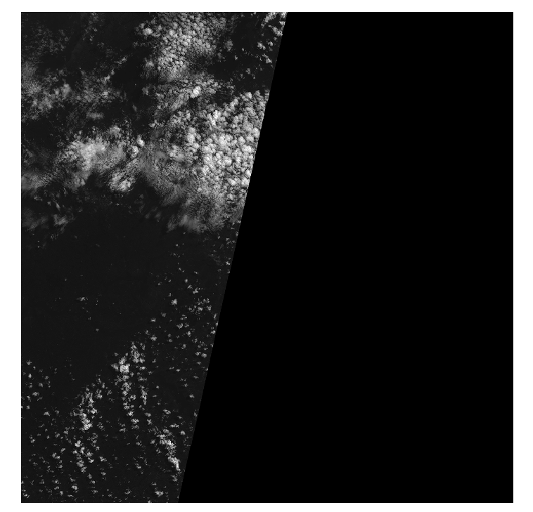

# Creating Cloud Corrected Sentinel-2 Images
Erick Verleye, ESIIL Software Developer

A common issue when working with remote imaging data is that for a single image,
it is likely that the instrument's field of view is at least partially occulted by clouds.
A popular approach to producing a cloud-cleaned image over a particular region is to stitch 
together a time series of images to create a composite. 

In this tutorial, we will create cloud-cleaned composites from Sentinel2 Level-1 C data
acquired by the methods described at https://data-library.esiil.org/reomte_sensing/sentinel2_aws/sentinel2_aws. 

The steps to creating a cloud-cleaned composite are outlined as:  

    - For each Sentinel-2 image in the time series:  
        -- Use cloud file to filter image pixels which are 0 or above some threshold  
    - Combine filtered images over the entire time series into one composite using the median of pixel values
    

First let's look at the file structure created after downloading the data:  


There is information about the location, date, and file contents in the file name.
The structure is <military_grid_tile>_<date>_<file_contents>. For example, the file
35_N_RA_2017_6_17_0_B02.jp2 covers the 35NRA military grid tile, is from the date 6-17-2017,
and contains Band 2 data. The '0' between the band is the sequence, and can be ignored.
More information on military grid tiles can be found at https://www.maptools.com/tutorials/mgrs/quick_guide

The strategy will be to process the files as groups according to their military grid tile and band across the
entire time series. For example, a single processing group for tile 36NTF and Band 2 would be:  

[
2017_6_17/36_N_TF_2017_6_17_0_B02.jp2,
2017_6_24/36_N_TF_2017_6_24_0_B02.jp2,
2017_6_27/36_N_TF_2017_6_27_0_B02.jp2
]

The cloud file for each military tile and date will always end in '_qi_MSK_CLOUDS_B00.gml' and can
be used to correct all other bands.  

Let's now introduce some code that will allow us to process a single tile and band at a time.  

In this tutorial we are creating composites from a relatively short time series. In practice, it 
may take several months worth of data to create a sufficiently cloud-free composite. Working with 
large time series sets is a memory intensive process. Thus, we will also be implementing a 'slice'
parameter which allows the user to specify how many slices the images should be split into when processing. 
For example, when the slices parameter is 20, only 1/20th of each image will be cloud corrected at a time. 
At the end, these slices will be stitched back together.

First, we must import some modules. The non-native package versions used are:  

  - rasterio==1.3.6
  - geopandas==0.13.0
  - numpy==1.24.3
  - tqdm==4.65.0
  
You must also have GDAL installed, the version used for this tutorial is 3.6.4

``` {python}
import os 
import warnings
import shutil

import rasterio
from rasterio import features
from rasterio.windows import Window
import geopandas as gpd
import numpy as np
from tqdm import tqdm
```

Next, we define some constants and helper functions for loading in data and
cleaning it:  

``` {python}
MAX_BAND_VAL = 4000  # counts

# Helper function for opening Sentinel-2 jp2 files, with optional slicing
def get_img_from_file(img_path, g_ncols, dtype, row_bound=None):
    img = rasterio.open(img_path, driver='JP2OpenJPEG')
    ncols, nrows = img.meta['width'], img.meta['height']
    assert g_ncols == ncols, f'Imgs have different size ncols: {ncols} neq {g_ncols}'
    if row_bound is None:
        pixels = img.read(1).astype(np.float32)
    else:
        pixels = img.read(
            1,
            window=Window.from_slices(
                slice(row_bound[0], row_bound[1]),
                slice(0, ncols)
            )
        ).astype(dtype)
    return pixels

# Helper function for reading in cloud file array, with optional slicing
def get_cloud_mask_from_file(cloud_path, crs, transform, shape, row_bound=None):
    # filter out RuntimeWarnings, due to geopandas/fiona read file spam
    # https://stackoverflow.com/questions/64995369/geopandas-warning-on-read-file
    warnings.filterwarnings("ignore", category=RuntimeWarning)
    try:
        cloud_file = gpd.read_file(cloud_path)
        cloud_file.crs = (str(crs))
        # convert the cloud mask data to a raster that has the same shape and transformation as the
        # img raster data
        cloud_img = features.rasterize(
            (
                (g['geometry'], 1) for v, g in cloud_file.iterrows()
            ),
            out_shape=shape,
            transform=transform,
            all_touched=True
        )
        if row_bound is None:
            return np.where(cloud_img == 0, 1, 0)
        return np.where(cloud_img[row_bound[0]:row_bound[1], :] == 0, 1, 0)
    except Exception as e:
        return None

# Function for filtering out cloud pixels
def nan_clouds(pixels, cloud_channels, max_pixel_val: float = MAX_BAND_VAL):
    cp = pixels * cloud_channels
    mask = np.where(np.logical_or(cp == 0, cp > max_pixel_val))
    cp[mask] = np.nan
    return cp
```

Finally we define our main function, which will create our cloud-cleaned composite for a single military 
tile and optical band:  

``` {python}
def create_cloud_cleaned_composite(in_dir: str, mgrs_tile: str, band: str, out_file: str, num_slices: int = 12) -> None:
    """
    Creates a cloud cleaned composite tif file from a set of sentinel 2 files
    Args:
        in_dir (str): Directory containing all of the date directories which contain the sentinel 2 data
        mgrs_tile (str): The military grid coordinate (35MGR, 36MTV, etc.) to create the composite for 
        band (str): The optical band for which to create the composite for (B02, B03, B08) etc.
        num_slices (int): The amount of slices to split the composite up into while building it.
                          More slices will use less RAM
    """
    # Loop through each band, getting a median estimate for each
    crs = None
    transform = None
    
    # Find each optical and cloud file in the input directory for the mgrs_tile and band combination
    mgrs_str = f'{mgrs_tile[:2]}_{mgrs_tile[2]}_{mgrs_tile[3:]}'.upper()
    band_str = band.upper()
    dates = os.listdir(in_dir)
    file_sets = []
    for date_dir in dates:
        optical_file = None
        cloud_file = None
        for file in os.listdir(os.path.join(in_dir, date_dir)):
            f_up = file.upper()
            file_path = os.path.join(in_dir, date_dir, file)
            if mgrs_str in file and band_str in file:
                optical_file = file_path
            elif mgrs_str in file and 'MSK_CLOUDS_B00' in file:
                cloud_file = file_path
        
        if optical_file is None or cloud_file is None:
            continue
                                
        file_sets.append((optical_file, cloud_file))
        
    # Resolve the crs and other optical file attributes. Should be the same 
    # regardless of date so loop through all until found
    crs = None
    transform = None
    g_nrows = None
    g_ncols = None
    for file_set in file_sets:
        with rasterio.open(file_set[0], 'r', driver='JP2OpenJPEG') as rf:
            g_nrows = rf.meta['height'] if g_nrows is None else g_nrows
            g_ncols = rf.meta['width'] if g_ncols is None else g_ncols
            crs = rf.crs if crs is None else crs
            transform = rf.transform if transform is None else transform
            if crs is not None and transform is not None and g_nrows is not None and g_ncols is not None:
                break

    if crs is None or transform is None or g_nrows is None or g_ncols is None:
        raise LookupError(f'Could not determine the following projection attributes from the available '
                          f'sentinel2 files in {in_dir}: \n' \
                          f'{"CRS" if crs is None else ""} '
                          f'{"Transform" if transform is None else ""} '
                          f'{"Number of rows" if g_nrows is None else ""} '
                          f'{"Number of columns" if g_ncols is None else ""}')
    
    # Determine the slicing bounds to save memory as we process
    slice_height = g_nrows / num_slices
    slice_end_pts = [int(i) for i in np.arange(0, g_nrows + slice_height, slice_height)]
    slice_bounds = [(slice_end_pts[i], slice_end_pts[i + 1] - 1) for i in range(num_slices - 1)]
    slice_bounds.append((slice_end_pts[-2], slice_end_pts[-1]))   

    # Correct the images one slice at a time, and then combine the slices. First create a temp directory in
    # the out_dir to store the slices 
    slice_dir = os.path.join(os.path.dirname(out_file), 'slices')
    os.makedirs(slice_dir, exist_ok=True)
    for k, row_bound in tqdm(enumerate(slice_bounds), desc=f'band={band}', total=num_slices, position=2):
        slice_file_path = os.path.join(slice_dir, f'{row_bound[0]}_{row_bound[1]}.tif')
        cloud_correct_imgs = []
        for file_set in tqdm(file_sets, desc=f'slice {k + 1}', leave=False, position=3):
            # Get data from files
            optical_file = file_set[0]
            cloud_file = file_set[1]
            pixels = get_img_from_file(optical_file, g_ncols, np.float32, row_bound)
            cloud_channels = get_cloud_mask_from_file(cloud_file, crs, transform, (g_nrows, g_ncols), row_bound)
            if cloud_channels is None:
                continue
            # add to list to do median filter later
            cloud_correct_imgs.append(nan_clouds(pixels, cloud_channels))
            del pixels
        corrected_stack = np.vstack([img.ravel() for img in cloud_correct_imgs])
        median_corrected = np.nanmedian(corrected_stack, axis=0, overwrite_input=True)
        median_corrected = median_corrected.reshape(cloud_correct_imgs[0].shape)
        with rasterio.open(slice_file_path, 'w', driver='GTiff', width=g_ncols, height=g_nrows,
                           count=1, crs=crs, transform=transform, dtype=np.float32) as wf:
            wf.write(median_corrected.astype(np.float32), 1)
        
        # release mem
        median_corrected = []
        del median_corrected
        corrected_stack = []
        del corrected_stack

    # Combine slices
    with rasterio.open(out_file, 'w', driver='GTiff', width=g_ncols, height=g_nrows,
                       count=1, crs=crs, transform=transform, dtype=np.float32) as wf:
        for slice_file in os.listdir(slice_dir):
            bound_split = slice_file.split('.')[0].split('_')
            top_bound = int(bound_split[0])
            bottom_bound = int(bound_split[1])
            with rasterio.open(os.path.join(slice_dir, slice_file), 'r', driver='GTiff') as rf:
                wf.write(
                    rf.read(1),
                    window=Window.from_slices(
                        slice(top_bound, bottom_bound),
                        slice(0, g_ncols)
                    ),
                    indexes=1
                )

    shutil.rmtree(slice_dir)
    print(f'Wrote file to {out_file}')

```

Let's run an example now, using the files downloaded in the sentinel2 on aws
tutorial for mgrs 36NUG and band B02. A figure of the file structure is included
above. Make sure to change the in_dir and out_file parameters to match your environment.

``` {python}
create_cloud_cleaned_composite(in_dir=<your_in_dir>, mgrs_tile='36NUG', band='B02', out_file='test.tif')
```

This should create an output file called test.tif in your working directory that is cloud cleaned.
Let's take a look at the results.  

First, let's look at the sentinel2 B02 file used from each day:  




As you can see there are many clouds, and sometimes the image is not fully populated with values.

Let us now look at the output file, test.tif, and see if the clouds were removed and the images stitched together.


We can see that all of the areas that used to be clouds are now NaN, or white in the image. As stated previously, 
to get a full image with no NaNs may require months worth of data. It is achievable with this code, but too much for this tutuorial.
Over several months there will be days where the areas now in white are not covered by clouds, and thus the median of those days' pixels
will begin to fill in the white spots until you have a full image. 


